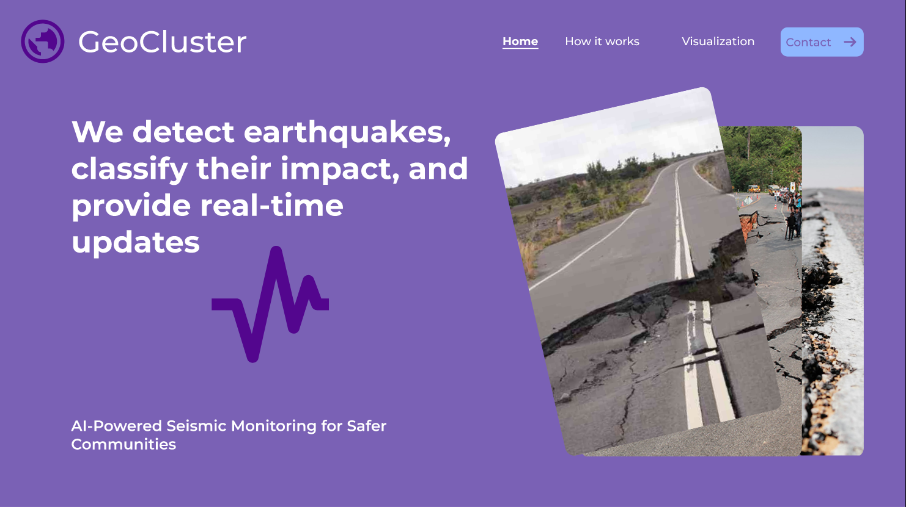
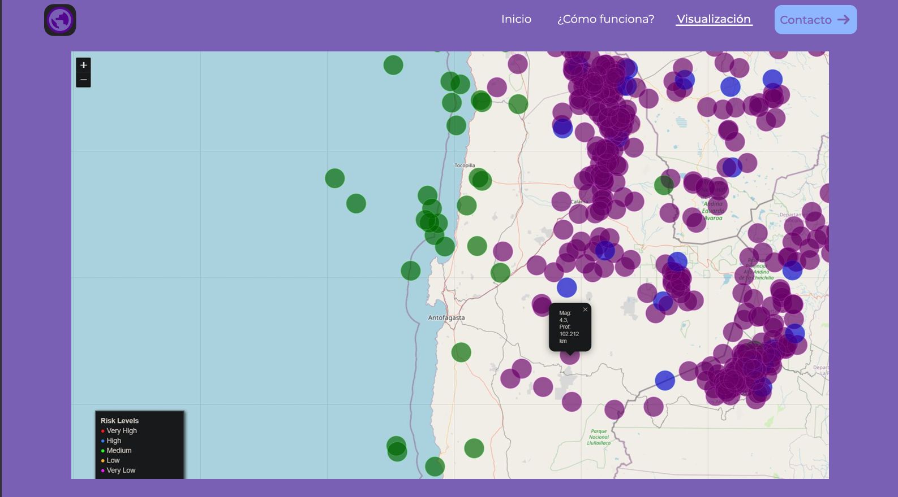
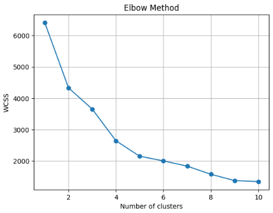
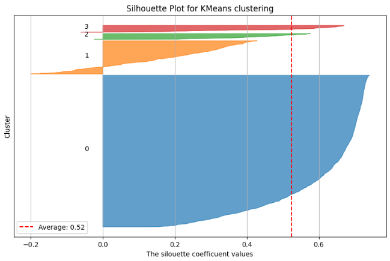
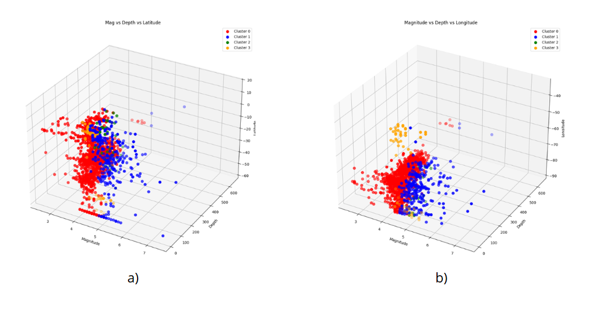

# GeoCluster — Seismic Risk Classifier for South America



> Una herramienta basada en Machine Learning para detectar, clasificar y visualizar eventos sísmicos en Sudamérica según su nivel de riesgo, a través de un mapa interactivo georreferenciado.

---

## Descripción

Sudamérica es una de las regiones sísmicamente más activas del planeta. La convergencia de cuatro placas tectónicas —Sudamericana, Nazca, Caribe y Cocos— genera una actividad sísmica constante: solo en 2024 se registraron más de **52.000 eventos sísmicos**, 23 de los cuales superaron magnitud 6 en la escala de Richter.

**GeoCluster** responde a la falta de herramientas accesibles para el análisis sísmico comunitario, aplicando técnicas de clustering no supervisado para:

- **Identificar** patrones en eventos sísmicos históricos
- **Clasificar** sismos en 4 niveles de riesgo: Low, Medium, High y Very High
- **Visualizar** los resultados en un mapa interactivo georreferenciado
- **Apoyar** la toma de decisiones en gestión de riesgos y protección civil

---

## Demo

|            Homepage            |             ¿Cómo funciona?              |
| :----------------------------: | :--------------------------------------: |
|  |  |



> Cada punto en el mapa representa un evento sísmico. El color indica su nivel de riesgo: 🟡 Low · 🟢 Medium · 🔵 High · 🔴 Very High

---

## Modelo de ML

GeoCluster utiliza el algoritmo **K-Means** con **Transfer de selección de variables** asistido por Random Forest para agrupar eventos sísmicos según sus características físicas y geográficas.

### Variables utilizadas

| Variable | Descripción                                       |
| -------- | ------------------------------------------------- |
| `mag`    | Magnitud del sismo (escala Richter)               |
| `nst`    | Número de estaciones que detectaron el evento     |
| `magNst` | Relación entre magnitud y cobertura de estaciones |
| `dmin`   | Distancia a la estación de detección más cercana  |

> La selección de variables se realizó mediante un modelo auxiliar de **Random Forest** y una matriz de correlación. `mag` y `nst` resultaron las más influyentes (correlación: 0.69).

### Configuración del modelo

```python
KMeans(
    n_clusters=4,       # Determinado por el método del codo
    init='k-means++',   # Optimización de centroides iniciales
    max_iter=300,
    n_init=10,
    random_state=42
)
```

### Resultados por cluster

| Cluster | Nivel de riesgo   | Mag. promedio | Profundidad (km) | nst promedio |
| :-----: | ----------------- | :-----------: | :--------------: | :----------: |
|    0    | 🟡 Medium Risk    |     4.27      |      93.42       |    31.15     |
|    1    | 🔴 Very High Risk |     5.04      |      75.13       |    109.34    |
|    2    | 🔵 High Risk      |     4.78      |      99.98       |    95.10     |
|    3    | 🟢 Low Risk       |     4.71      |      11.20       |    40.14     |

### Métricas de evaluación

| Métrica                | Valor       |
| ---------------------- | ----------- |
| Silhouette Score       | **0.52**    |
| Número de clusters (k) | **4**       |
| Eventos analizados     | **52.155+** |

|      Método del codo       |           Silhouette Plot            |          Scatter 3D          |
| :------------------------: | :----------------------------------: | :--------------------------: |
|  |  |  |

---

## Metodología

El proyecto sigue la metodología **CRISP-ML**, que estructura el ciclo de vida completo de proyectos de Machine Learning:

1. **Planificación** — Definición de objetivos: identificar y clasificar zonas de riesgo sísmico en Sudamérica
2. **Preparación de datos** — Limpieza, imputación por media, normalización con `StandardScaler`
3. **Ingeniería de modelos** — Selección de variables con Random Forest + matriz de correlación
4. **Implementación** — K-Means con k=4 determinado por el método del codo; visualización con Folium
5. **Evaluación** — Silhouette Score, curva del codo, interpretación geofísica por cluster
6. **Supervisión** — Apertura a incorporar variables adicionales (localización geográfica, profundidad) para potenciar el análisis

---

## Estructura del repositorio

```
GeoCluster/
│
├── assets/                  # Imágenes para el README
│   ├── banner.png           # Homepage de la interfaz
│   ├── how-it-works.png     # Sección "¿Cómo funciona?"
│   ├── map.png              # Mapa interactivo Folium
│   ├── elbow.png            # Método del codo
│   ├── silhouette.png       # Silhouette Plot
│   └── scatter-3d.png       # Visualización 3D de clusters
├── GeoClusters.ipynb        # Notebook principal (análisis + modelo + visualización)
└── README.md
```

---

## Instalación y uso

### 1. Clonar el repositorio

```bash
git clone https://github.com/jpbustamanteb026/GeoCluster.git
cd GeoCluster
```

### 2. Instalar dependencias

```bash
pip install pandas numpy scikit-learn matplotlib folium jupyter
```

### 3. Ejecutar el notebook

```bash
jupyter notebook GeoClusters.ipynb
```

O abrirlo directamente en Google Colab:

[](https://colab.research.google.com/drive/1A2IUuSIJ2X6kZviMergVGxXB_zsuAiYG?usp=sharing)

### 4. Usar el modelo entrenado

```python
import pickle
import pandas as pd
from sklearn.preprocessing import StandardScaler

# Cargar modelo
with open("kmeans_model.pkl", "rb") as f:
    model = pickle.load(f)

# Preparar datos nuevos (mag, nst, magNst, dmin)
nuevos_sismos = pd.DataFrame({
    "mag": [4.5],
    "nst": [45],
    "magNst": [0.1],
    "dmin": [0.3]
})

scaler = StandardScaler()
datos_norm = scaler.fit_transform(nuevos_sismos)

cluster = model.predict(datos_norm)
niveles = {0: "Medium Risk", 1: "Very High Risk", 2: "High Risk", 3: "Low Risk"}
print(f"Nivel de riesgo: {niveles[cluster[0]]}")
```

> **Nota:** Los datos del USGS utilizados cubren el período 23-06-2024 al 23-06-2025 y están disponibles en el [catálogo público del USGS](https://earthquake.usgs.gov/earthquakes/search/).

---

## Tecnologías

- **Python 3**
- **scikit-learn** — K-Means, Random Forest (selección de variables), StandardScaler
- **Pandas / NumPy** — procesamiento y limpieza de datos
- **Matplotlib** — visualizaciones estáticas (elbow, silhouette, scatter 3D)
- **Folium** — mapa interactivo georreferenciado
- **Jupyter Notebook / Google Colab** — entorno de desarrollo

---

## Autores

Desarrollado como proyecto académico en el **Semillero PADIA, Universidad San Buenaventura Cali, Colombia**.

| Nombre                        |
| ----------------------------- |
| Valerie S. Olave Pineda       |
| Natalia Giraldo Amador        |
| Juan P. Bustamante            |
| Carlos G. Hidalgo _(docente)_ |

---

## 📄 Licencia

Este proyecto es de carácter académico. Todos los derechos reservados a sus autores y a la Universidad San Buenaventura Cali.
